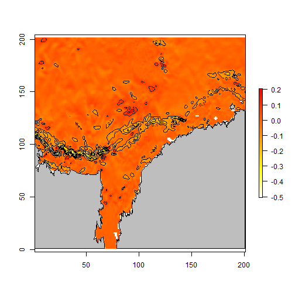

## oms - R for ROMS


```r
## filename of ROMS data
fp <- "slice3101.nc"
```


```r
library(oms)
coords <- romscoords(fp)
library(rworldxtra)
data(countriesHigh)

## 4th level (depth), 3rd time step
slc <- c(4, 3)
u <- romsdata(fp, "u", slice = slc)
v <- romsdata(fp, "v", slice = slc)
   
temp <- romsdata(fp, "temp", slice = slc)   
## translate a SpatialPolygons data set to the ROMS mesh
## (also clips to the extents)
map <- romsmap(countriesHigh, coords)

plot(temp, col = rev(heat.colors(100)))
contour(sqrt(u ^ 2 + v ^ 2), add = TRUE)
plot(map, add = TRUE, col = "grey")
```


