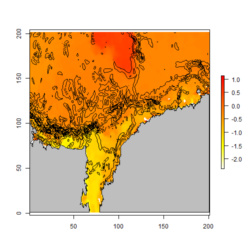
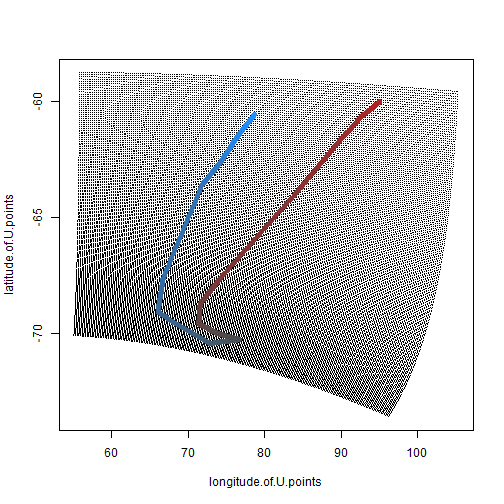
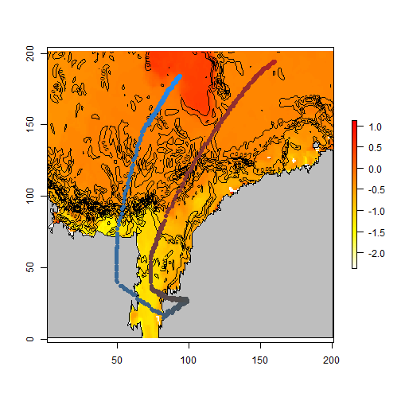

## Usage 

```r
## filename of ROMS data
fp <- "slice3101.nc"

library(angstroms)
## RasterStack of the lon_u/lat_u coords
coords <- romscoords(fp)
```
`

```r
## a polygon data set
library(rworldxtra)
data(countriesHigh)

## extract a single z/time slice of ROMS data, on native grid 
## 4th level (depth), 3rd time step
slc <- c(4, 3)

# u and v components of velocity
u <- romsdata(fp, "u", slice = slc)
v <- romsdata(fp, "v", slice = slc)
   
# temperature
temp <- romsdata(fp, "temp", slice = slc)   

## translate a SpatialPolygons data set to the ROMS mesh
## (also clips to the extents)
map <- romsmap(countriesHigh, coords)
```

```
## Loading required namespace: rgeos
```

```r
## plot temperature + current mag contours
plot(temp, col = rev(heat.colors(100)))
contour(sqrt(u ^ 2 + v ^ 2), add = TRUE)
## add polygons
plot(map, add = TRUE, col = "grey")
```



Track data


```r
plot(as.matrix(coords), pch = ".")
#tr <- locator()
rawtr <- structure(list(x = c(78.6376482505178, 76.3968349542337, 74.3283919115098, 
71.8290232348852, 66.7441007548557, 66.0546197406145, 72.7770596294669, 
76.7415754613543, 73.8112811508289, 71.3980976009844, 71.5704678545447, 
74.2422067847297, 83.8949409841076, 89.1522337176973, 92.5134536621236, 
95.0128223387483), y = c(-60.5752415948338, -61.5286502387784, 
-62.579844384666, -63.6065921550678, -67.6157977347322, -69.1070266393635, 
-70.4515772910802, -70.2804526626799, -70.0115425323366, -69.5959541490787, 
-68.7403310070771, -67.6157977347322, -64.0221805383257, -61.9442386220362, 
-60.6730270967768, -60.0129749586613)), .Names = c("x", "y"))

tr0 <- as.data.frame(rawtr)
tr <- data.frame(x = approx(seq(nrow(tr0)), tr0$x, n = 450)$y, 
                 y = approx(seq(nrow(tr0)), tr0$y, n = 450)$y)
tr$gmt <- Sys.time() + sort(runif(length(tr$x), 100, 1e5))
tr$ID <- "1"
library(trip)
coordinates(tr) <- c("x", "y")
tr <- trip(tr, c("gmt", "ID"))

plotrack <- function(x, col = colorRampPalette(c("dodgerblue", "grey30", "firebrick")), ...) {
  scl <- function(x) (x  - min(x)) / diff(range(x))
  timescale <- scl(unclass(x[[getTORnames(x)[1]]]))
  cols <- col(100)[timescale * 99 + 1]
  points(x, col = cols, ...)
}
plotrack(tr, pch = 19)
```



```r
romstr0 <- romsmap(as(tr, "SpatialPointsDataFrame"), coords)
romstr <- trip(romstr0, c("gmt", "ID"))
plot(temp, col = rev(heat.colors(100)))
contour(sqrt(u ^ 2 + v ^ 2), add = TRUE)
## add polygons
plot(map, add = TRUE, col = "grey")
plotrack(romstr, pch = 19)
```



